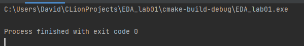
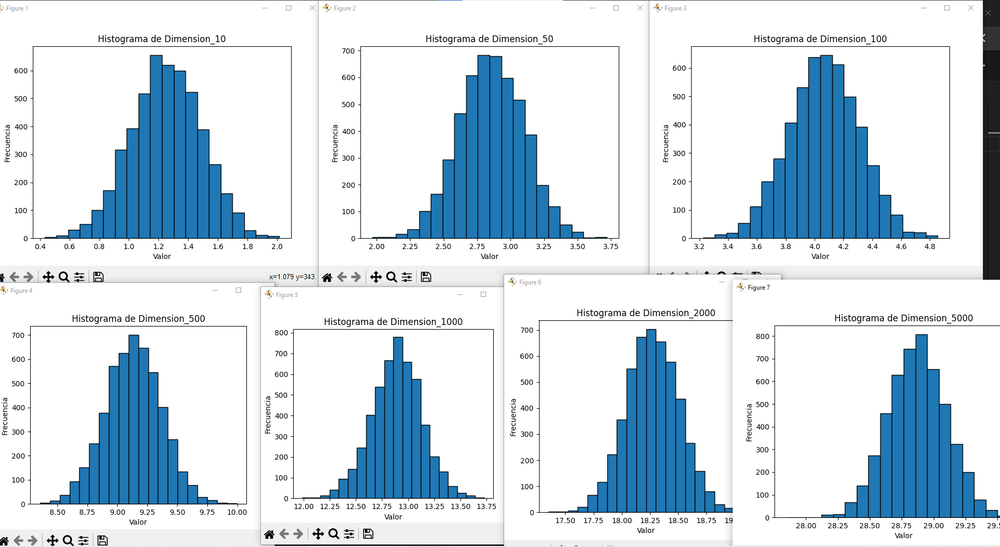
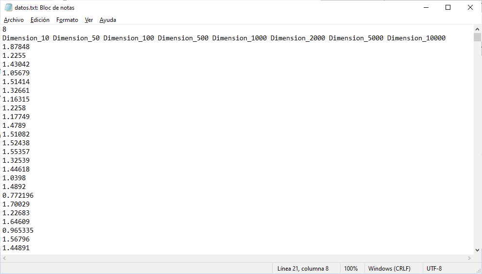
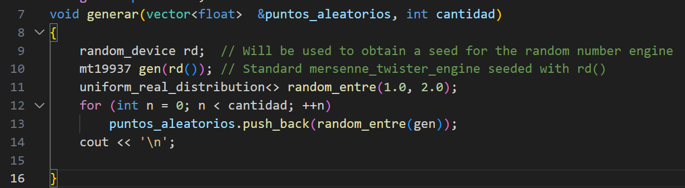
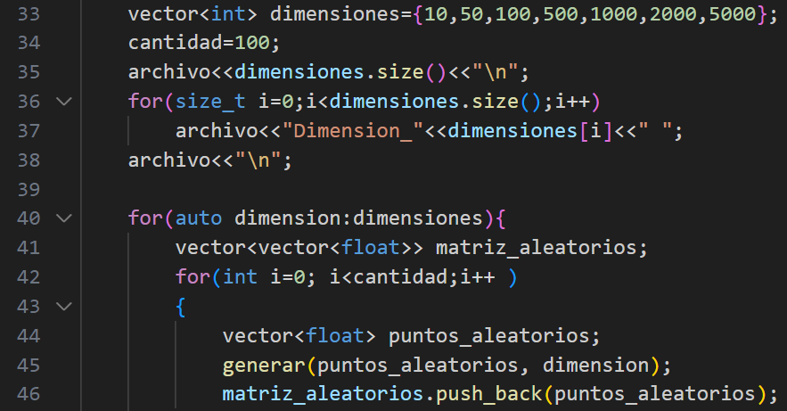
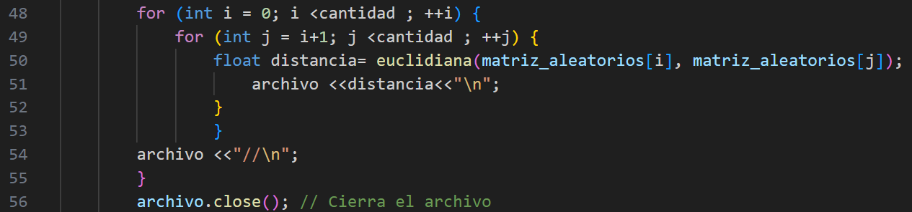
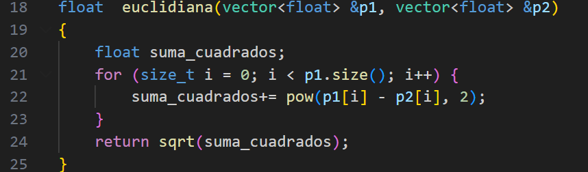

# eda_lab

1  Cuanto más grande es la dimensión  más grande es la distancia entre 2 puntos (ref1)
Al contar con varias dimensiones la distancia euclidiana se vuelve más grande. El eje X mantiene
su distribución en forma de campana  pero se dispersa o aleja del 0 o origen. 
2 En mi ejecución las frecuencias(eje Y) aunque varian no cambian a más de 100 mientras más dimensiones y cercana a 5000 sea.

Primero Genero los puntos 

Para cada grupo de diferente dimension

Luego calcula las distancias y las  guarda en datos.txt 

Luego genero con Python las graficas, usando 1 1ra linea para el nro de grupos, 2da linea para las etiquetas, y desde la 3era para los datos usando saltos de linea como separador de datos y "//" como separador de grupos de datos

[1]	N. Arrioja, "La maldición de la dimensionalidad," Medium, 2019. [Online]. https://medium.com/@nicolasarrioja/la-maldici%C3%B3n-de-la-dimensionalidad-f7a6248cf9a. [Accedido: 20-09-2023].

